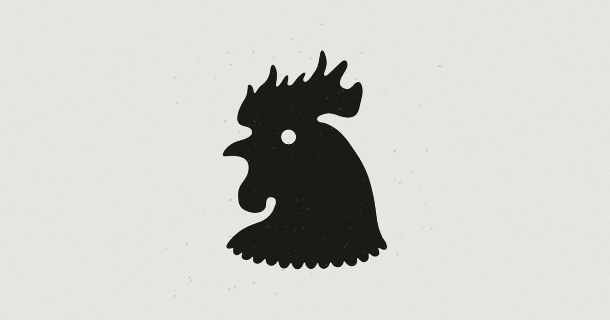

  

<h1 align="center">Overlord AI — The Sovereign Desktop Gaming Co-Pilot</h1>

  <strong>Never alt-tab again. An intelligent, real-time gaming companion that watches your screen and talks you through every mission, boss fight, and hidden secret.</strong>

  
  
  
  

---

## ⚡ What is Overlord AI?

**[Overlord AI](https://www.overlordai.co/)** is a lightweight, low-latency desktop companion built for PC gamers who want deep tactical mastery without breaking their immersion. 

Instead of pausing to search wikis, scrolling through Reddit threads, or scrubbing through 40-minute YouTube walkthroughs, **Overlord AI sits alongside your game, observes your screen in real time (<200ms latency), and speaks contextual advice, boss mechanics, and secret waypoints directly through your headset.**

  

---

## 🎮 Key Features

* **👁️ Real-Time Screen Awareness**: Inspects gameplay visual state with sub-second responsiveness without degrading your framerate.
* **🎙️ Natural Voice Co-Pilot**: Powered by ultra-low-latency local neural voice synthesis. Hear tactical callouts as naturally as talking to a co-op partner.
* **🗺️ Built-in Secret & Ability Atlas**: Instant access to hidden loot, breakable walls, Ability Points (AP), secret rafters, and exclusive upgrades across supported titles.
* **🛡️ Zero Performance Overhead**: Whisper-silent edge capture designed to preserve maximum GPU rendering budget and 144+ FPS refresh rates.
* **🚫 Zero Alt-Tab Distraction**: Stay focused on the fight. No intrusive full-screen overlays—just crisp, actionable audio guidance when you need it.

---

## 🎯 Supported Titles & Specializations

* **Black Myth: Wukong**: Chapter secrets, hidden meditation spots, spirit transformations, and boss counter-strategies.
* **Control (Remedy Entertainment)**: Complete hidden Ability Point (AP) atlas, secret rafters, breakable walls, and exclusive weapon mods (such as *Eternal Fire*).
* **Expanding Catalog**: New game profiles, boss guides, and tactical radar maps added continuously.

---

## 🔗 Quick Links & Resources

| Destination | Link |
|---|---|
| 🌐 **Live Website** | [https://www.overlordai.co/](https://www.overlordai.co/) |
| 💳 **Plans & Pricing** | [https://www.overlordai.co/plans.html](https://www.overlordai.co/plans.html) |
| 🔐 **Account & Downloads** | [https://www.overlordai.co/login.html](https://www.overlordai.co/login.html) |
| 💬 **Support & Knowledge Base** | [https://www.overlordai.co/support.html](https://www.overlordai.co/support.html) |
| ⚖️ **Terms & EULA** | [https://www.overlordai.co/terms.html](https://www.overlordai.co/terms.html) |

---

## 💻 Repository Structure

This repository powers the official public web presence and documentation for **[Overlord AI](https://www.overlordai.co/)**:

* `index.html` — Homepage featuring interactive live demos, value proposition, and feature breakdowns.
* `plans.html` — Transparent tier selection (Free Demo, Subscription, and Pro lifetime options).
* `login.html` & `signup.html` — Client authentication portals.
* `dashboard.html` — Member license management, client download portal, and telemetry options.
* `support.html` — Help desk, FAQ, and technical requirements.

---

## 🛡️ License & Trademarks

All brand assets, software architecture, and companion systems are proprietary to Overlord AI. Game titles, characters, and trademarks cited are the property of their respective publishers and developers.
